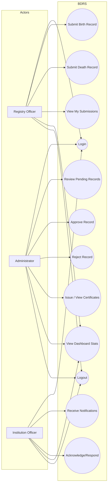

## CHAPTER THREE
## DESIGN AND METHODOLOGY

### 3.0 Introduction

This chapter presents the design and methodology adopted for the development of the **Birth and Death Registration System (BDRS)**. It describes the proposed solution, system specifications, the rationale for the selected technologies and tools, the system architecture, and the detailed system design. The chapter also provides two modeling diagrams and the database design used to implement the system.

### 3.1 The Proposed System

The proposed system is a secure, role-based, web application that digitizes the end-to-end workflow for managing vital records. The system supports the creation of **birth** and **death** registrations, their review and verification, certificate issuance, and institution notifications. By transitioning from manual/paper-driven processes to a centralized platform, the system improves traceability, reduces processing time, and strengthens access control to sensitive citizen data.

#### 3.1.1 Core Actors and Responsibilities

The system is designed around three primary actors:

- **Registry Officer (Registrar)**: creates and submits birth and death registration records, attaches supporting document references, and tracks the status of previously submitted records.
- **Administrator**: performs supervisory functions including verification/approval or rejection of submitted records, certificate issuance, and overall monitoring via the administrative dashboard.
- **Institution Officer** (Bank/Insurance/Pension/SSNIT): receives death-related notifications relevant to their institution type and acknowledges or responds to those notifications.

#### 3.1.2 Operational Overview

Authentication is handled by a server-generated session represented as a signed **JWT** stored in an **httpOnly cookie**. Authorization is enforced at the routing layer using Next.js middleware to prevent unauthorized access to protected modules. Business operations are implemented in Next.js server routes (API endpoints) and persist data in a PostgreSQL database through Prisma ORM.

### 3.2 System Specification

This section describes the functional and non-functional requirements for the BDRS. These requirements guided the implementation and serve as acceptance criteria for evaluating system completeness.

#### 3.2.1 Functional Requirements

**FR1: User Authentication and Session Management**

- The system shall allow users to log in using email and password credentials.
- The system shall create an authenticated session and store it securely in a server-set cookie.
- The system shall allow a user to log out and invalidate/clear the session cookie.
- The system shall provide a mechanism to retrieve the current authenticated user profile (where applicable).

**FR2: Role-Based Access Control (RBAC)**

- The system shall restrict access to protected modules to authenticated users only.
- The system shall restrict access based on user role:
  - Administrator access to the administrative dashboard and verification functions.
  - Registry officer access to registrar workflows and submission pages.
  - Institution officers access to their institution-specific module(s).

**FR3: Birth Registration**

- The system shall enable registry officers to create birth registration records with required fields (child details, parents/guardian details, and supporting document reference where available).
- The system shall store the record status and associated review metadata (e.g., notes and rejection reason).
- The system shall enable authorized personnel to update the registration status according to the workflow.

**FR4: Death Registration**

- The system shall enable registry officers to create death registration records with required fields (deceased identity, death details, informant details, and supporting document reference).
- The system shall support status progression and store review metadata including rejection reason.
- The system shall support next-of-kin/institution linkage where applicable (for institutional lookups).

**FR5: Record Retrieval and Management**

- The system shall support listing of records:
  - by registrar (submitted by the current registrar),
  - by status (pending, verified, rejected, etc.),
  - and across the system for administrative users.
- The system shall support retrieval of a single record for review.

**FR6: Verification Workflow**

- The system shall allow authorized reviewers to approve (verify) a pending record.
- The system shall allow authorized reviewers to reject a record and provide a rejection reason.

**FR7: Certificates**

- The system shall generate/store certificate metadata for eligible verified records (e.g., certificate number and issue date).

**FR8: Notifications**

- The system shall create and maintain notifications to relevant institutions for death records.
- The system shall allow institution officers to mark notifications as received/responded.

**FR9: Audit and Traceability**

- The system shall store timestamps for creation and updates for core entities.
- The system shall retain the linkage between records and the users who created and/or verified them.

#### 3.2.2 Non-Functional Requirements

**NFR1: Security**

- The system shall store session tokens in an **httpOnly** cookie and enforce secure cookie transmission in production environments (HTTPS).
- The system shall store passwords as salted hashes using a strong hashing algorithm (bcrypt).
- The system shall enforce authorization checks server-side (middleware and API routes) and not depend solely on client-side checks.

**NFR2: Reliability and Fault Tolerance**

- The system shall respond to invalid requests with appropriate HTTP status codes and error messages.
- Database operations shall be designed to avoid partial writes for multi-step actions (where applicable).
- Development seed data shall be repeatable to support testing and demonstration.

**NFR3: Performance**

- The system shall optimize common queries (e.g., dashboard statistics, filtering by status) and avoid unnecessary data transfer.
- The system shall support future enhancements such as pagination and caching for large datasets.

**NFR4: Maintainability**

- The system shall use modular organization to separate UI, API route handlers, and data access logic.
- The system shall use TypeScript type definitions to enhance clarity and reduce defects during maintenance.

**NFR5: Scalability**

- The architecture shall be capable of scaling horizontally at the web tier and vertically at the database tier, with room for future introduction of message queues or caching services.

**NFR6: Usability**

- The system shall provide role-specific navigation and dashboards that reduce cognitive load and guide users through the intended workflow.

### 3.3 Selection of Technologies and Tools

The selection of technologies was based on suitability for secure web application development, developer productivity, maintainability, and compatibility with relational data modeling.

- **Next.js (App Router)**: provides server rendering, routing, middleware, and API endpoints within a unified framework, thereby enabling rapid full-stack development.
- **React + TypeScript**: supports component-based UI development and compile-time type checking for more reliable code.
- **Prisma ORM**: provides schema-first modeling, migrations, and a type-safe database client which reduces errors in database access logic.
- **PostgreSQL**: a robust relational database suitable for highly structured records and relationships (users, records, institutions, and notifications).
- **JWT**: used to represent authenticated sessions in a compact, signed format suitable for stateless validation.
- **bcrypt**: used for secure password hashing to mitigate password compromise risk.
- **Tailwind CSS**: accelerates UI styling while maintaining consistent design across modules.
- **ESLint**: promotes code quality and consistency through static analysis.

### 3.4 Architecture of the System

The BDRS follows a layered architecture comprising a presentation layer, an application/service layer, and a data layer. This separation of concerns improves maintainability and supports future extension.

#### 3.4.1 Architectural Layers

- **Presentation Layer (Client/UI)**: Next.js pages and reusable components render role-based views and interact with internal API endpoints.
- **Application Layer (Server/API)**: Next.js route handlers implement authentication, validation, business rules, and workflow actions. Middleware enforces session validation and route authorization.
- **Data Layer (Database)**: PostgreSQL persists the system data. Prisma defines the schema and provides the client used by the application layer.

#### 3.4.2 System Architecture Diagram

*Figure 3.1: High-level architecture of the Birth and Death Registration System (BDRS).*

```mermaid
flowchart TB
  U[Users: Registrar / Admin / Institution Officer] -->|HTTP(S)| W[Next.js Web Application]
  W -->|UI Pages (App Router)| UI[Presentation Layer]
  W -->|API Routes| API[Application Layer]
  W -->|Middleware: auth + RBAC| MW[Access Control]
  API -->|Prisma Client| ORM[Prisma ORM]
  ORM --> DB[(PostgreSQL Database)]
```

### 3.5 Design of the System

This section presents the structural and behavioral models used to describe the system. In addition, it outlines the workflow logic implemented for authentication, record submission, verification, and notifications.

#### 3.5.1 Use Case Model

The use case model summarizes how each actor interacts with the system and the scope of functionality provided.

*Figure 3.2: Use case model for BDRS.*



#### 3.5.2 Flow Chart of the System

The flow chart in Figure 3.3 summarizes the main operational workflow of the system from authentication through record submission, verification, and institutional notification. It emphasizes the decision points that control record status transitions and access to protected modules.

*Figure 3.3: Flow chart of the BDRS workflow (authentication, submission, verification, notification).*

```mermaid
flowchart TD
  S([Start]) --> L[Open System]
  L --> Q{User authenticated?}
  Q -- No --> LG[Login]
  LG --> C{Credentials valid?}
  C -- No --> E1[Display error and retry] --> LG
  C -- Yes --> SES[Create session cookie] --> R{Role}

  Q -- Yes --> R

  R -- Registry Officer --> RO[Registrar dashboard]
  R -- Administrator --> AD[Admin dashboard]
  R -- Institution Officer --> IO[Institution module]

  RO --> SUB{Submit record type}
  SUB -- Birth --> B1[Enter birth details + documents] --> B2[Save record as PENDING_VERIFICATION]
  SUB -- Death --> D1[Enter death details + documents] --> D2[Save record as PENDING_VERIFICATION]
  B2 --> WAIT[Await review]
  D2 --> WAIT

  AD --> REV[View pending records]
  REV --> DEC{Approve or reject?}
  DEC -- Approve --> APP[Mark as VERIFIED / issue certificate when applicable]
  DEC -- Reject --> REJ[Mark as REJECTED + record reason]

  APP --> N{Death record approved?}
  N -- Yes --> NOTIF[Create notifications to institutions] --> IOQ[Institutions receive notice]
  N -- No --> END1([End])

  IO --> INBOX[View notifications]
  INBOX --> ACK[Mark as RECEIVED / respond]
  ACK --> END2([End])

#### 3.5.3 Database Design

The database was designed using a relational model to support referential integrity, traceability, and reliable reporting. Prisma was used to define the schema and generate a type-safe client for application use. Key tables/entities include:

- **User**: authentication identity, role, optional institution linkage.
- **Institution**: institution metadata (bank/insurance/pension) and its officers.
- **BirthRecord** and **DeathRecord**: core vital record tables with workflow status tracking.
- **Certificate**: issued certificate metadata tied to a death record (extendable to birth records if required).
- **Notification**: institution-level notifications for death records.
- **NextOfKin**: lookup/relationship data between a death record and an institution’s next-of-kin information.
- **Session / Account / Verification**: authentication-related tables used for tracking sessions and verification flows.

*Figure 3.4: Entity Relationship Diagram (ERD) of the BDRS database.*

```mermaid
erDiagram
  USER {
    String id PK
    String email UK
    String password
    Role role
    String institutionId FK
    Boolean emailVerified
    DateTime createdAt
    DateTime updatedAt
  }

  INSTITUTION {
    String id PK
    String name
    InstitutionType type
    String email
    Boolean status
  }

  BIRTHRECORD {
    String id PK
    String childName
    DateTime dateOfBirth
    String placeOfBirth
    RecordStatus status
    String createdById FK
    String verifiedById FK
    DateTime createdAt
    DateTime updatedAt
  }

  DEATHRECORD {
    String id PK
    String fullName
    DateTime dateOfBirth
    DateTime dateOfDeath
    String placeOfDeath
    String causeOfDeath
    RecordStatus status
    String createdById FK
    String verifiedById FK
    DateTime createdAt
    DateTime updatedAt
  }

  CERTIFICATE {
    String id PK
    String deathRecordId UK
    String certificateNumber UK
    DateTime issueDate
    String issuedById FK
  }

  NOTIFICATION {
    String id PK
    String deathRecordId FK
    String institutionId FK
    NotificationStatus status
    DateTime sentAt
    DateTime receivedAt
    String viewedById FK
  }

  NEXTOFKIN {
    String id PK
    String deathRecordId FK
    String institutionId FK
    NextOfKinLookupStatus lookupStatus
    DateTime createdAt
    DateTime updatedAt
  }

  SESSION {
    String id PK
    String token UK
    DateTime expiresAt
    String userId FK
  }

  ACCOUNT {
    String id PK
    String accountId
    String providerId
    String userId FK
  }

  VERIFICATION {
    String id PK
    String identifier
    String value
    DateTime expiresAt
  }

  INSTITUTION ||--o{ USER : employs
  USER ||--o{ BIRTHRECORD : "creates (createdById)"
  USER ||--o{ DEATHRECORD : "creates (createdById)"
  USER ||--o{ CERTIFICATE : issues
  USER ||--o{ SESSION : has
  USER ||--o{ ACCOUNT : has

  USER ||--o{ BIRTHRECORD : "verifies (verifiedById)"
  USER ||--o{ DEATHRECORD : "verifies (verifiedById)"

  DEATHRECORD ||--o| CERTIFICATE : has
  DEATHRECORD ||--o{ NOTIFICATION : triggers
  INSTITUTION ||--o{ NOTIFICATION : receives
  USER ||--o{ NOTIFICATION : views

  DEATHRECORD ||--o{ NEXTOFKIN : has
  INSTITUTION ||--o{ NEXTOFKIN : provides
```

#### 3.5.4 Integrity Constraints and Data Validation

- `User.email` is unique.
- `Certificate.deathRecordId` and `Certificate.certificateNumber` are unique.
- `NextOfKin` is unique per `(deathRecordId, institutionId)` to prevent duplicates.
- Session tokens are unique (`Session.token`) to prevent session collisions.

In addition to database constraints, server-side validation is applied when creating or updating records to ensure required fields are present and correctly formatted (e.g., date parsing, required contact fields, and status normalization).

